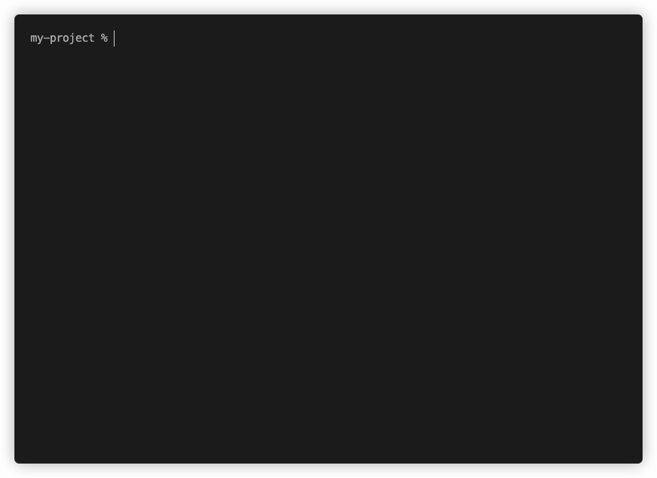

# Formatters

In cucumber-js, Formatters ingest data about your test run in real time and then output content, either to the console or a file, in a useful format. (Some frameworks refer to this kind of thing as "reporters".)

cucumber-js provides many built-in Formatters, plus building blocks with which you can write your own formatter.

You can specify one or more formats via the `--format <TYPE[:PATH]>` CLI option, where `TYPE` is one of:

* The name of one of the built-in formatters (below) e.g. `progress`
* A module/package name e.g. `@cucumber/pretty-formatter`
* A relative path to a local formatter implementation e.g. `./my-customer-formatter.js`

If `PATH` is supplied, the formatter prints to the given file, otherwise it prints to `stdout`.

Some notes on specifying Formatters:

* If multiple formatters are specified with the same output, only the last is used.
* If no formatter for `stdout` is specified, we default to the `progress` formatter.

## Options

Many formatters, including the built-in ones, support some configurability via options. You can provide this data as a JSON literal via the `--format-options` CLI option, like this:

```shell
$ cucumber-js --format-options '{"someOption":true}'
```

This option is repeatable, so you can use it multiple times and the objects will be merged with the later ones taking precedence.

## Built-in formatters

### `summary`

The Summary Formatter outputs a summary of the test run's results.

If everything passed, this will be pretty concise:


Where there are failures, you'll see the detail of them:


