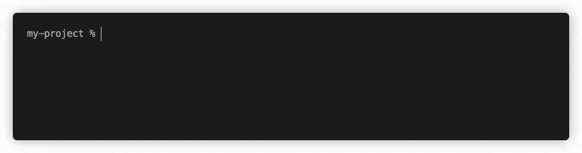
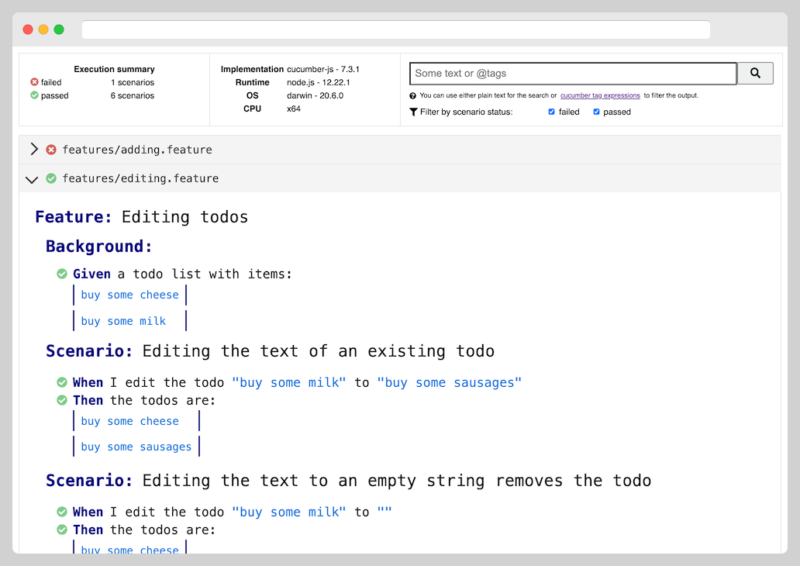

# Formatters

In cucumber-js, Formatters ingest data about your test run in real time and then output content, either to the console or a file, in a useful format. (Some frameworks refer to this kind of thing as "reporters".)

cucumber-js provides many built-in Formatters, plus building blocks with which you can [write your own](./custom_formatters.md).

You can specify one or more formats via the `--format <TYPE[:PATH]>` CLI option, where `TYPE` is one of:

* The name of one of the built-in formatters (below) e.g. `progress`
* A module/package name e.g. `@cucumber/pretty-formatter`
* A relative path to a local formatter implementation e.g. `./my-customer-formatter.js`

If `PATH` is supplied, the formatter prints to the given file, otherwise it prints to `stdout`.

Some notes on specifying Formatters:

* If multiple formatters are specified with the same output, only the last is used.
* If no formatter for `stdout` is specified, we default to the `progress` formatter.

## Options

Many formatters, including the built-in ones, support some configurability via options. You can provide this data as a JSON literal via the `--format-options` CLI option, like this:

```shell
$ cucumber-js --format-options '{"someOption":true}'
```

This option is repeatable, so you can use it multiple times and the objects will be merged with the later ones taking precedence.

Some options offered by built-in formatters:

- `colorsEnabled` - if set to `false`, colors in terminal output are disabled.

## Built-in formatters

### `summary`

The Summary Formatter outputs a summary of the test run's results.

If everything passed, this will be short and sweet:


If there were issues, you'll see useful details including:

- Failed hooks or steps including error messages and stack traces
- Locations of any pending steps
- [Snippets](./snippets.md) to implement any undefined steps

### `progress`

The Progress Formatter has the same output as the Summary Formatter at the end of the test run, but also provides concise real-time feedback each time a step or hook completes:



### `progress-bar`

Similar to the Progress Formatter, but provides a real-time updating progress bar based on the total number of steps to be executed in the test run:


*Note: the Progress Bar Formatter will only work with a TTY terminal (and not, for example, a file stream).*

### `html`

The HTML Formatter produces a rich interactive report bundled as a standalone HTML page:



You can:

- See detailed results including error messages and stack traces
- See attachments rendered in-place
- Filter to specific statuses
- Search by keywords or tag expressions

### `message`

Outputs all the [Cucumber Messages](https://github.com/cucumber/cucumber/tree/master/cucumber-messages) for the test run as newline-delimited JSON, which can then be consumed by other tools.

### `json`

Outputs details of the test run in the legacy JSON format.

*Note: this formatter is in maintenance mode and won't have new features added to it. Where you need a structured data representation of your test run, it's best to use the `message` formatter. Tools that rely on this formatter will continue to work, but are encouraged to migrate to consume the `message` output instead.*

### `snippets`

The Snippets Formatter doesn't output anything regarding the test run; it just prints [Snippets to implement any undefined steps](./snippets.md). This is useful when you want to quickly zero in on the steps you have to implement and grab the snippet code for them in one go.

### `usage`

The Usage Formatter lists your step definitions and tells you about usages in your scenarios, including the duration of each usage, and any unused steps. Here's an example of the output:

```
┌───────────────────────────────────────┬──────────┬─────────────────────────────────┐
│ Pattern / Text                        │ Duration │ Location                        │
├───────────────────────────────────────┼──────────┼─────────────────────────────────┤
│ an empty todo list                    │ 760.33ms │ support/steps/steps.ts:6        │
│   an empty todo list                  │ 820ms    │ features/empty.feature:4        │
│   an empty todo list                  │ 761ms    │ features/adding-todos.feature:4 │
│   an empty todo list                  │ 700ms    │ features/empty.feature:4        │
├───────────────────────────────────────┼──────────┼─────────────────────────────────┤
│ I add the todo {string}               │ 432.00ms │ support/steps/steps.ts:10       │
│   I add the todo "buy some cheese"    │ 432ms    │ features/adding-todos.feature:5 │
├───────────────────────────────────────┼──────────┼─────────────────────────────────┤
│ my cursor is ready to create a todo   │ 53.00ms  │ support/steps/steps.ts:27       │
│   my cursor is ready to create a todo │ 101ms    │ features/empty.feature:10       │
│   my cursor is ready to create a todo │ 5ms      │ features/adding-todos.feature:8 │
├───────────────────────────────────────┼──────────┼─────────────────────────────────┤
│ no todos are listed                   │ 46.00ms  │ support/steps/steps.ts:15       │
│   no todos are listed                 │ 46ms     │ features/empty.feature:7        │
├───────────────────────────────────────┼──────────┼─────────────────────────────────┤
│ the todos are:                        │ 31.00ms  │ support/steps/steps.ts:21       │
│   the todos are:                      │ 31ms     │ features/adding-todos.feature:6 │
├───────────────────────────────────────┼──────────┼─────────────────────────────────┤
│ I remove the todo {string}            │ UNUSED   │ support/steps/steps.ts:33       │
└───────────────────────────────────────┴──────────┴─────────────────────────────────┘
```

### `usage-json`

Does what the Usage Formatter does, but outputs JSON, which can be output to a file and then consumed by other tools.
